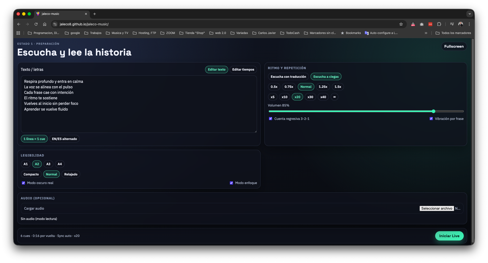
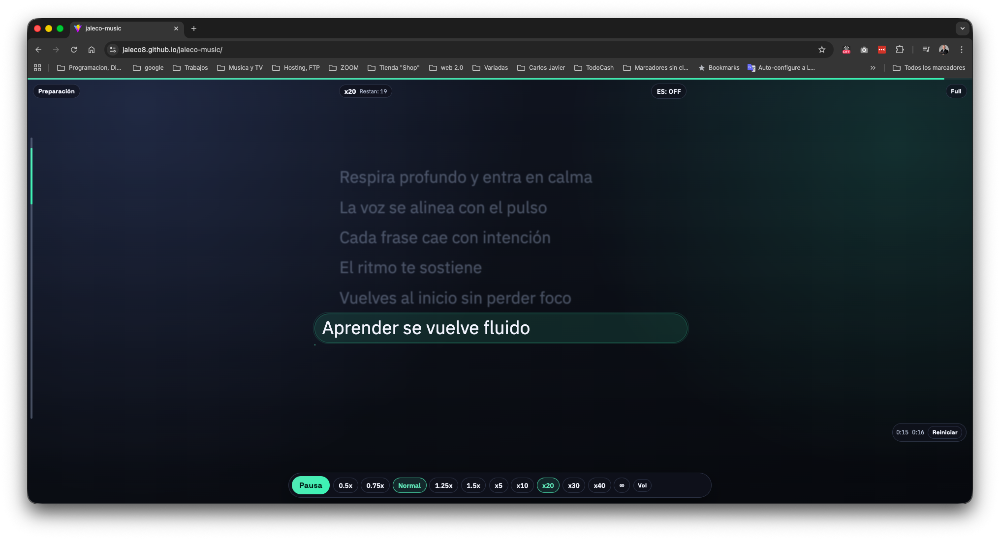

# Jaleco Music
**Teleprompter web tipo karaoke, mobile-first, para practicar letras o historias con audio, repetición y enfoque.**

[Demo en GitHub Pages](https://jaleco8.github.io/jaleco-music/) · [Reportar bug](../../issues) · [Roadmap](#roadmap)

> Funciona 100% en el navegador: sin backend, sin cuentas, sin subir tus archivos.

---

## Qué resuelve
Practicar un texto no debería ser una pelea contra el scroll, el foco o el ritmo.

Jaleco Music te da una experiencia tipo “karaoke” para **repetir**, **ajustar velocidad**, **controlar volumen** y **leer con enfoque** en una vista Live diseñada para móvil.

---

## Capturas

| Preparación | Live (en ejecución) |
|---|---|
|  |  |

---

## Funcionalidades clave

### Preparación
- Edición de texto/letras antes de iniciar.
- Modos de estudio: **Con traducción**, **Sin traducción** e **Interactivo**.
- Toggle independiente **A ciegas** para difuminar texto en Live.
- Velocidad: `0.5x · 0.75x · Normal · 1.25x · 1.5x`
- Repetición rápida: `x5 · x10 · x20 · x30 · x40 · ∞`
- Legibilidad: tamaños A1–A4, interlineado, modo oscuro y modo enfoque.
- Audio opcional: carga un archivo local (modo lectura si no hay audio).

### Live
- Auto-scroll con foco visual (teleprompter real, sin distracciones).
- Highlight animado por línea + progreso por “cue”.
- En modo **Interactivo** el foco visual prioriza preguntas (`[YES/NO]` o `?`).
- Controles ocultables y auto-hide durante reproducción.
- Gestos:
  - Doble tap izquierda: `-10s`
  - Doble tap derecha: `+10s`
  - Swipe horizontal: seek fino
  - Swipe vertical: tamaño de texto
- Modo “exploring” cuando haces scroll manual + botón para volver a seguir.
- Cuenta regresiva 3-2-1 opcional y vibración por frase opcional.

---

## Cómo usarlo (en 60 segundos)
1. Pega tu texto en **Preparación**.
2. (Opcional) Carga un audio local.
3. Ajusta velocidad, repetición y legibilidad.
4. Presiona **Iniciar Live**.
5. En Live, toca una vez para mostrar/ocultar controles y entra en flow.

---

## Ejecutar en local

Requisitos: **Node.js 18+**

```bash
npm install
npm run dev
